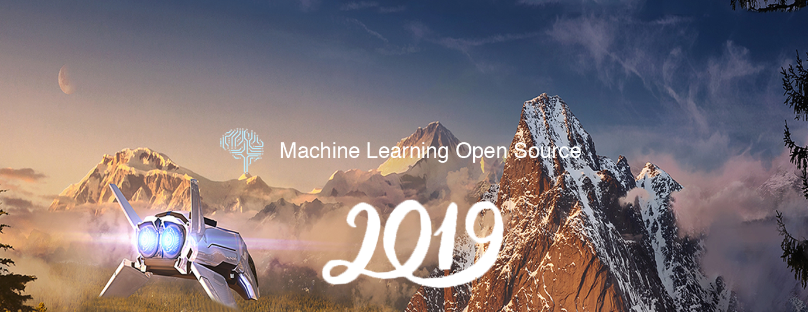

# amazing-machine-learning-opensource-2019
Amazing Machine Learning Open Source Tools and Projects for the Past Year (v.2019)

</a>

For the past year, we’ve compared nearly 22,000 Machine Learning open source tools and projects to pick Top 49 (0.22% chance).

The tools and projects are broken down by 6 categories

- [Computer Vision (1~5)](#Computer-Vision)
- [Reinforcement Learning (6~13)](#Reinforcement-Learning)
- [NLP (14~20)](#NLP)
- [GAN (21~26)](#GAN)
- [Neural Network (27~35)](#Neural-Network)
- [Toolkit (36~49)](#Toolkit)

This is an extremely competitive list and it carefully picks the best open source Machine Learning projects published between Jan and Dec 2018. Mybridge AI evaluates the quality by considering popularity, engagement and recency. To give you an idea about the quality, the average number of Github ⭐️ is 3,566.

Subscribe to Machine Learning Monthly: [Link](https://github.com/Mybridge/machine-learning-open-source)

 

## Learn

A) [Beginner: Machine Learning, Data Science and Deep Learning with Python. TensorFlow & Neural Networks](http://bit.ly/2FbgIcv) 84,632 recommends, 4.5/5 stars

B) [Advanced: Deep Reinforcement Learning in Python.](http://bit.ly/2DQxHjq) 20,396 recommends, 4.6/5 stars

 

## Amazing Open Source

#### Computer Vision
*[Detectron: FAIRs research platform for object detection research, implementing popular algorithms like Mask R-CNN and RetinaNet. ★18910](https://github.com/facebookresearch/Detectron)  
*[Openpose: Real-time multi-person keypoint detection library for body, face, and hands estimation ★11048](https://github.com/CMU-Perceptual-Computing-Lab/openpose)
*[DensePose: A real-time approach for mapping all human pixels of 2D RGB images to a 3D surface-based model of the body ★4165](https://github.com/facebookresearch/Densepose)
*[Maskrcnn-benchmark: Fast, modular reference implementation of Semantic Segmentation and Object Detection algorithms in PyTorch. ★3888](https://github.com/facebookresearch/maskrcnn-benchmark)
*[SNIPER is an efficient multi-scale object detection algorithm ★1963](https://github.com/mahyarnajibi/SNIPER)

#### Reinforcement Learning
*[Psychlab: Experimental paradigms implemented using the Psychlab platform (3D platform for agent-based AI) ★5594](https://github.com/deepmind/lab/tree/master/game_scripts/levels/contributed/psychlab)
*[ELF: An Extensive, Lightweight, and Flexible platform for game research. We have used it to build our Go playing bot, ELF OpenGo, which achieved a 14-0 record versus four global top-30 players ★2406](https://github.com/pytorch/elf)
*[TRFL: A library of useful building blocks for writing reinforcement learning (RL) agents in TensorFlow ★2312](https://github.com/deepmind/trfl)
*[Horizon: The first open source reinforcement learning platform for large-scale products and services ★1702](https://github.com/facebookresearch/Horizon)
*[Chess-alpha-zero: Chess reinforcement learning by AlphaGo Zero methods. ★1307](https://github.com/Zeta36/chess-alpha-zero)
*[Dm_control: The DeepMind Control Suite and Control Package ★1231](https://github.com/deepmind/dm_control)
*[MAMEToolkit: Arcade Game Reinforcement Learning Python Library ★437](https://github.com/M-J-Murray/MAMEToolkit)
*[Reaver: Reaver: Modular Deep Reinforcement Learning Framework. Focused on StarCraft II. Supports Gym, Atari, and MuJoCo. Matches reference results. ★355](https://github.com/inoryy/reaver)

#### NLP
*[Bert: TensorFlow code and pre-trained models for BERT ★11691](https://github.com/google-research/bert)
*[Pytext: A natural language modeling framework based on PyTorch ★4466](https://github.com/facebookresearch/pytext)
*[Bert-as-service: A NLP model developed by Google for pre-training language representations. It leverages an enormous amount of plain text data publicly available on the web and is trained in an unsupervised manner. ★2053](https://github.com/hanxiao/bert-as-service)
*[UnsupervisedMT: Phrase-Based & Neural Unsupervised Machine Translation - Facebook Research ★1066](https://github.com/facebookresearch/UnsupervisedMT)
*[DecaNLP: The Natural Language Decathlon: A Multitask Challenge for NLP - Salesforce ★1647](https://github.com/salesforce/decaNLP)
*[Nlp-architect: NLP Architect by Intel AI Lab: Python library for exploring the state-of-the-art deep learning topologies and techniques for NLP ★1751](https://github.com/NervanaSystems/nlp-architect)
*[Gluon-nlp: NLP made easy ★1262](https://github.com/dmlc/gluon-nlp)

#### GAN
*[DeOldify: A Deep Learning based project for colorizing and restoring old images ★5059](https://github.com/jantic/DeOldify)
*[Progressive_growing_of_gans: Progressive Growing of GANs for Improved Quality, Stability, and Variation ★4046](https://github.com/tkarras/progressive_growing_of_gans)
*[MUNIT: Multimodal Unsupervised Image-to-Image Translation ★1339](https://github.com/NVlabs/MUNIT)
*[Transparent_latent_gan: Use supervised learning to illuminate the latent space of GAN for controlled generation and edit ★1337](https://github.com/SummitKwan/transparent_latent_gan)
*[Gandissect: Pytorch-based tools for visualizing and understanding the neurons of a GAN. ★1064](https://github.com/CSAILVision/gandissect)
*[GANimation: Anatomically-aware Facial Animation from a Single Image ★869](https://github.com/albertpumarola/GANimation)

#### Neural Network
*[Fastai: It simplifies training fast and accurate neural nets using modern best practices ★11594](https://github.com/fastai/fastai)
*[DeepCreamPy: Decensoring Hentai with Deep Neural Networks ★7045](https://github.com/deeppomf/DeepCreamPy)
*[Augmentor v0.2: Image augmentation library in Python for machine learning. ★2805](https://github.com/mdbloice/Augmentor)
*[Graph_nets: Build Graph Nets in Tensorflow ★2722](https://github.com/deepmind/graph_nets)
*[Textgenrnn: Python module to easily generate text using a pretrained character-based recurrent neural network. ★1900](https://github.com/minimaxir/textgenrnn)
*[Person-blocker: Automatically "block" people in images (like Black Mirror) using a pretrained neural network. ★1806](https://github.com/minimaxir/person-blocker)
*[Deepvariant: DeepVariant is an analysis pipeline that uses a deep neural network to call genetic variants from next-generation DNA sequencing data. ★1502](https://github.com/google/deepvariant)
*[Video-nonlocal-net: Non-local Neural Networks for Video Classification ★1048](https://github.com/facebookresearch/video-nonlocal-net)
*[Ann-visualizer: A python library for visualizing Artificial Neural Networks (ANN) ★922](https://github.com/Prodicode/ann-visualizer)

#### Toolkit
*[Tfjs: A WebGL accelerated, browser based JavaScript library for training and deploying ML models. ★10265](https://github.com/tensorflow/tfjs)
*[Dopamine: A research framework for fast prototyping of reinforcement learning algorithms - Google ★7139](https://github.com/google/dopamine)
*[Lime: Explaining the predictions of any machine learning classifier ★5173](https://github.com/marcotcr/lime)
*[Autokeras: An open source software library for automated machine learning (AutoML) ★4517](https://github.com/jhfjhfj1/autokeras)
*[Shap: Explain the output of any machine learning model using expectations and Shapley values. ★3492](https://github.com/slundberg/shap)
*[MMdnn: A set of tools to help users inter-operate among different deep learning frameworks. E.g. model conversion and visualization. Convert models between Caffe, Keras, MXNet, Tensorflow ★3020](https://github.com/Microsoft/MMdnn)
*[Mlflow: Open source platform for the machine learning lifecycle ★3011](https://github.com/mlflow/mlflow)
*[Mace: A deep learning inference framework optimized for mobile heterogeneous computing platforms. ★2978](https://github.com/XiaoMi/mace)
*[PySyft: A Python library for secure, private Deep Learning. PySyft decouples private data from model training, using Multi-Party Computation (MPC) within PyTorch ★2594](https://github.com/OpenMined/PySyft)
*[Adanet: Fast and flexible AutoML with learning guarantees. ★2291](https://github.com/tensorflow/adanet)
*[Tencent-ml-images: Largest multi-label image database; ResNet-101 model; 80.73% top-1 acc on ImageNet ★2094](https://github.com/Tencent/tencent-ml-images)
*[Donkeycar: Open source hardware and software platform to build a small scale self driving car. ★1207](https://github.com/autorope/donkeycar)
*[PocketFlow: An Automatic Model Compression (AutoMC) framework for developing smaller and faster AI applications. ★1674](https://github.com/Tencent/PocketFlow)
*[DALI: A library containing both highly optimized building blocks and an execution engine for data pre-processing in deep learning applications ★1012](https://github.com/NVIDIA/dali)
